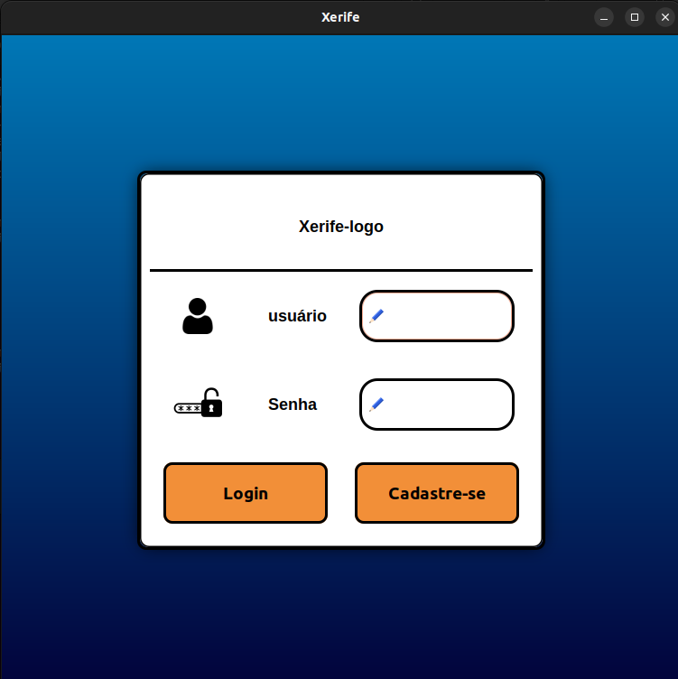

# Releitura do Sharif

Projeto final para a disciplina de Algoritmos e Estruturas de Dados 1.

## Tecnologias usadas

<div align="center">
  <a href="https://skillicons.dev">
    
  </a>
</div>

## Para executar:

### Tela Inicial



```bash
git clone https://github.com/DaniloLMD/Xerife/
cd Xerife
make
