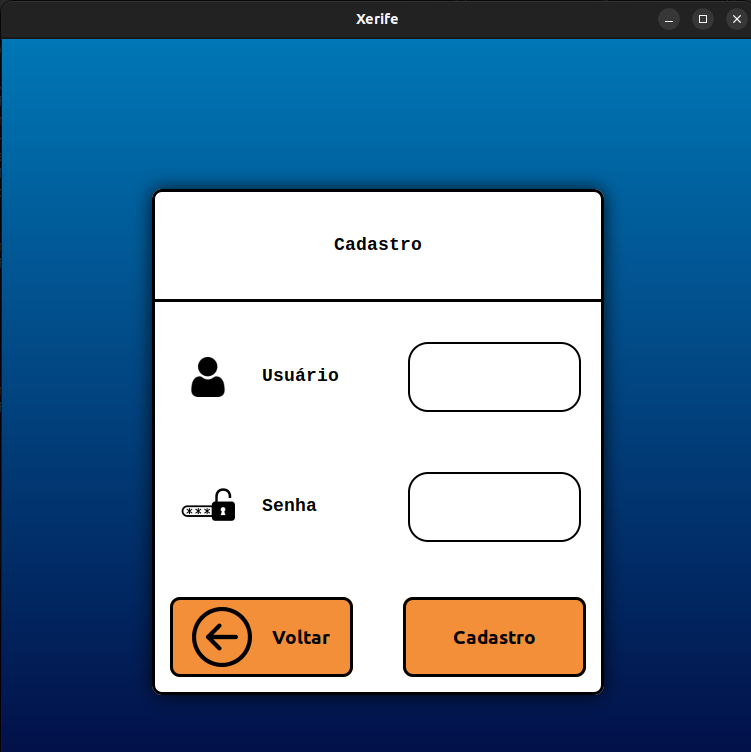
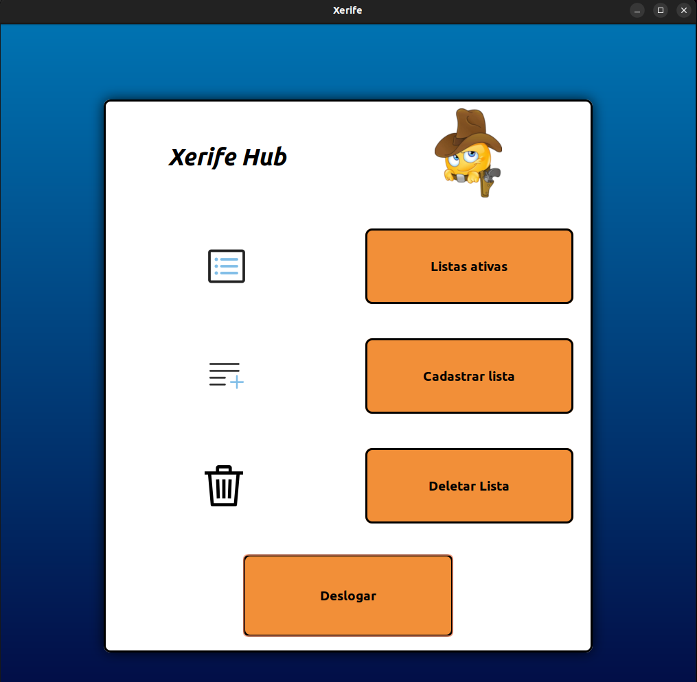
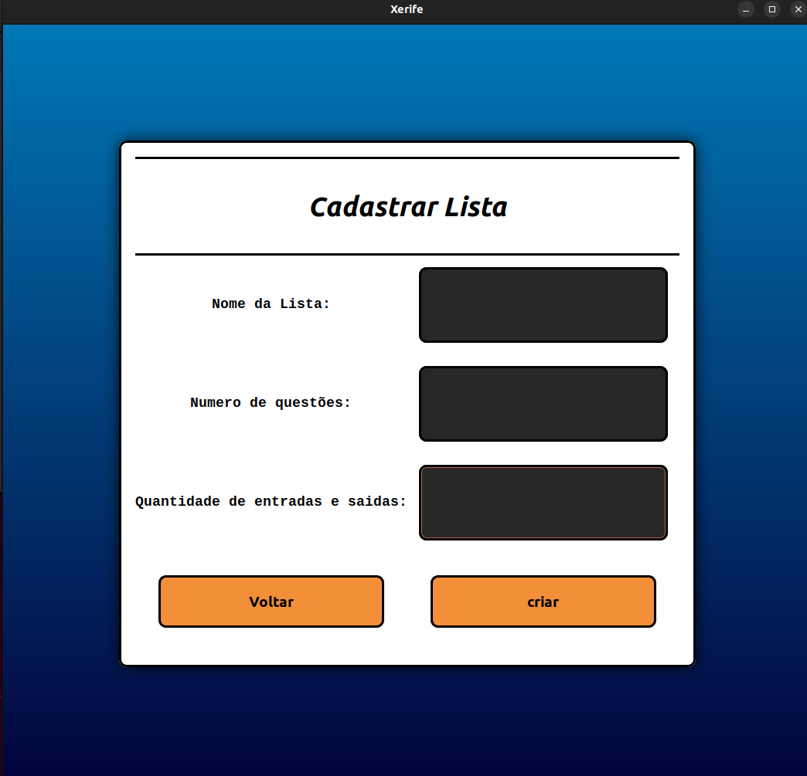
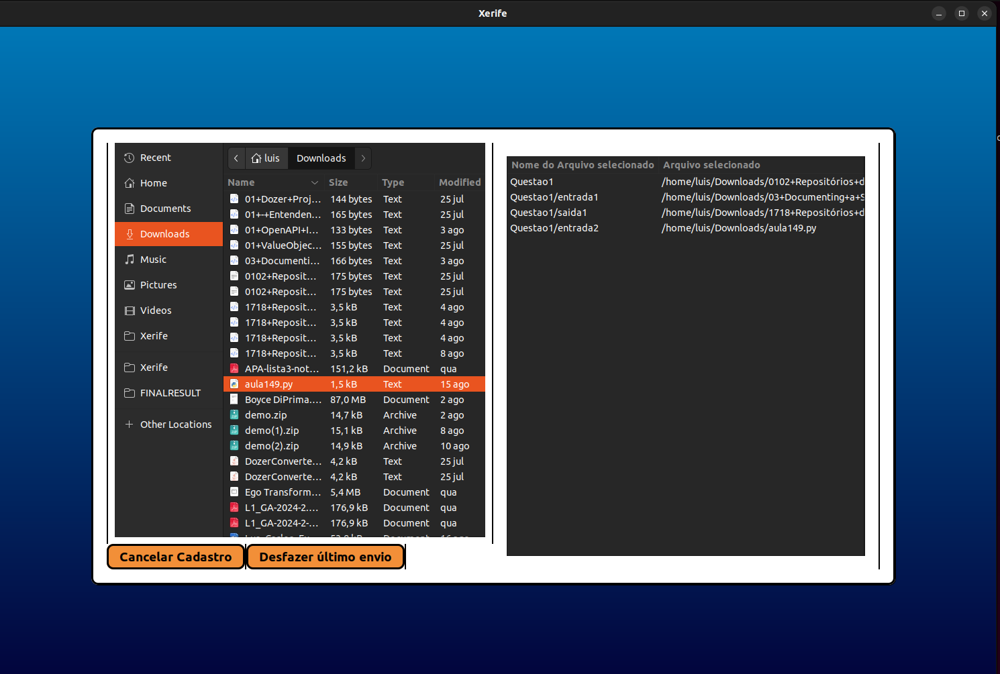
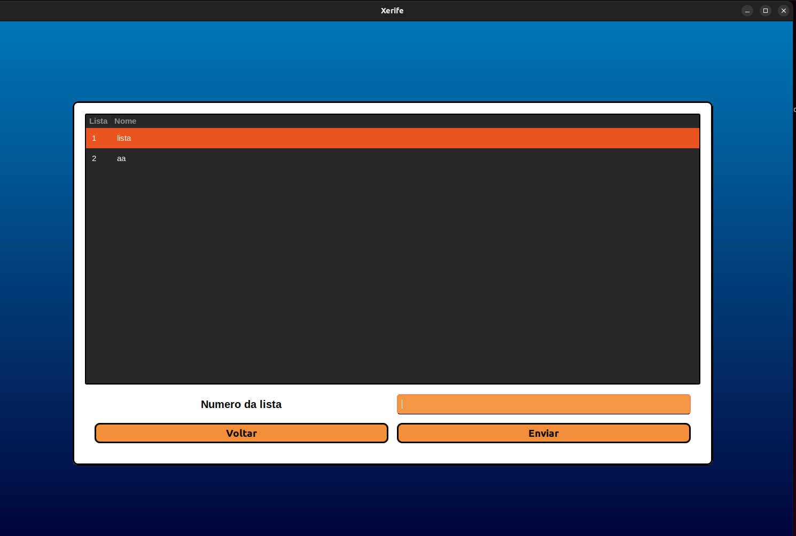
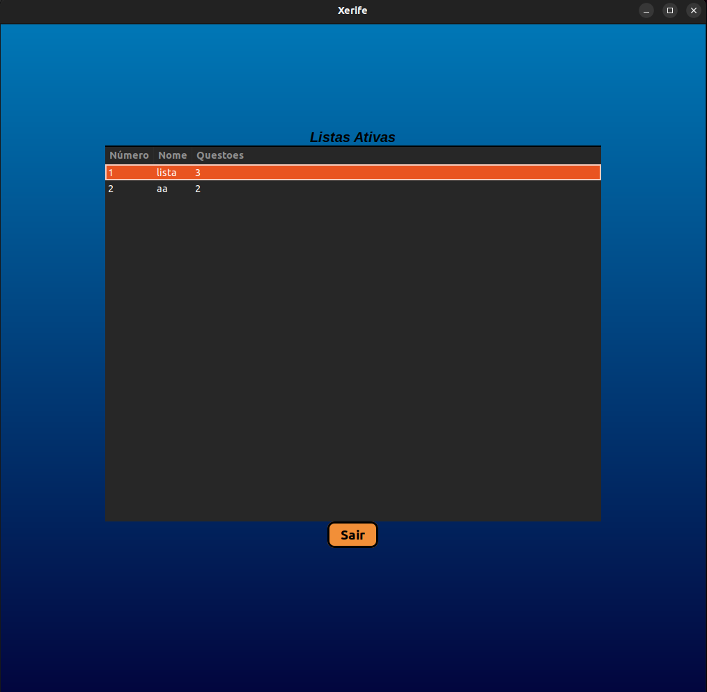
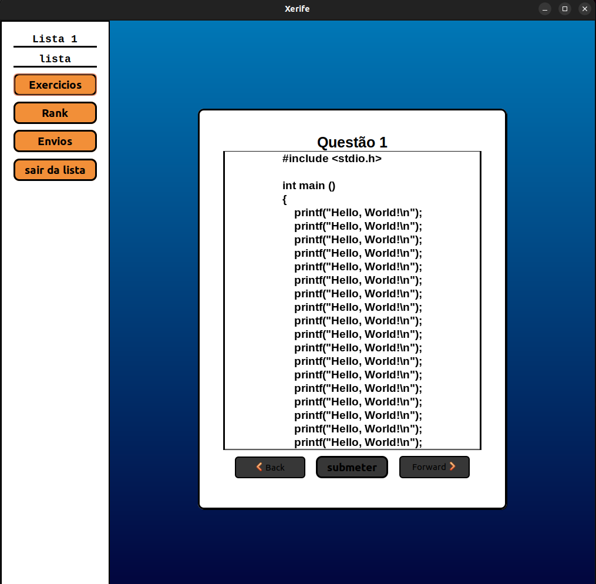
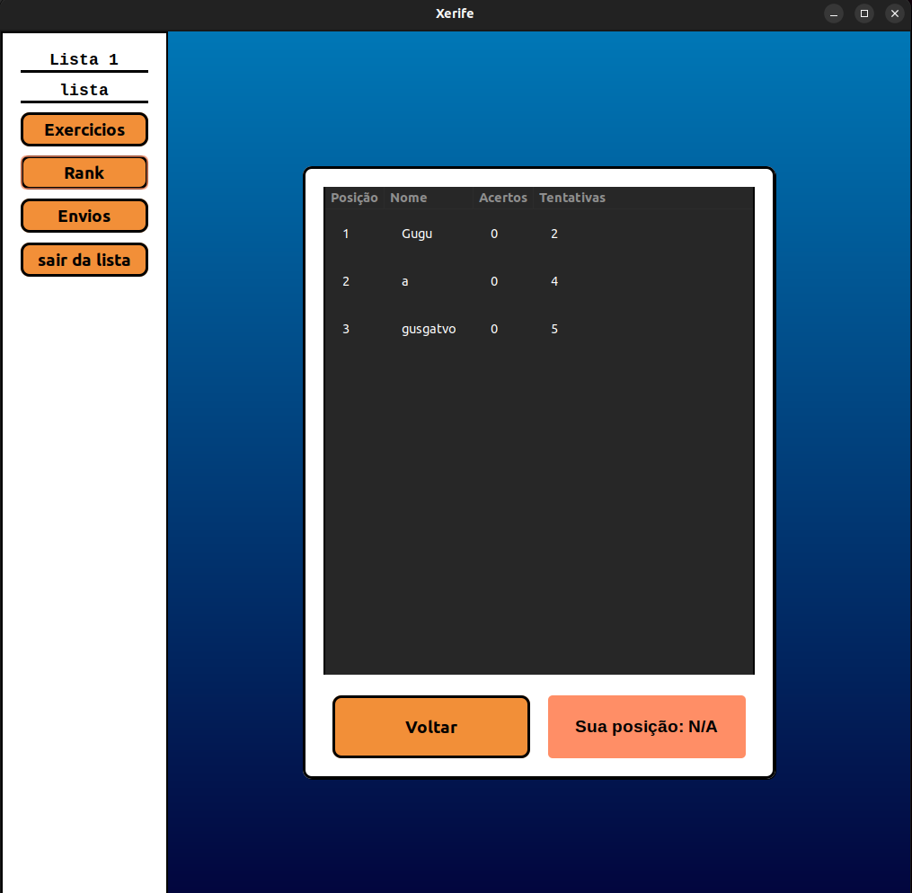
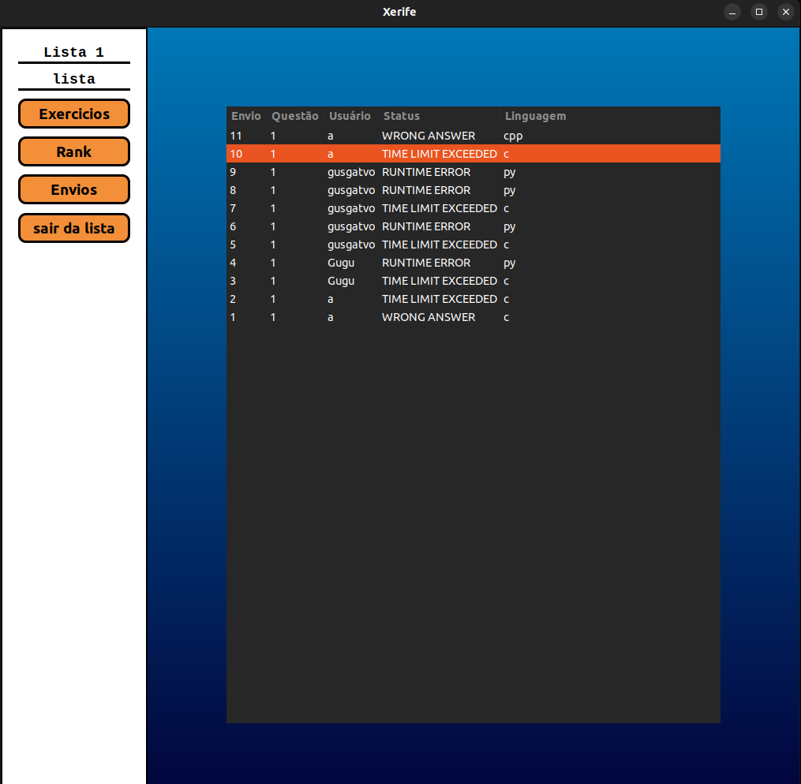

# Releitura do Sharif

Este projeto final foi desenvolvido para a disciplina de Algoritmos e Estruturas de Dados 1. O objetivo principal foi adaptar e aprimorar um sistema já existente utilizado na universidade, incorporando novas funcionalidades consideradas essenciais para a criação de uma plataforma robusta de avaliação de códigos (code judge).

## Tecnologias usadas

<div align="center">
  <a href="https://skillicons.dev">
    
  </a>
</div>
## Telas Do Aplicativo

## Telas Do Aplicativo

### Login


### Cadastro


### Hub Principal


### Cadastrar Lista


### Enviar Arquivos Da Lista


### Deletar Lista


### Listas Ativas


### Questões Ranks e Envios


### Rank


### Envios


## Para executar:
```bash
git clone https://github.com/DaniloLMD/Xerife/
cd Xerife
make
